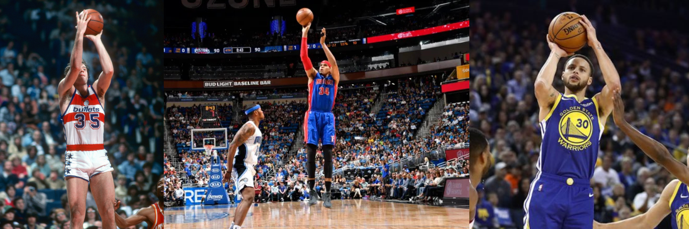
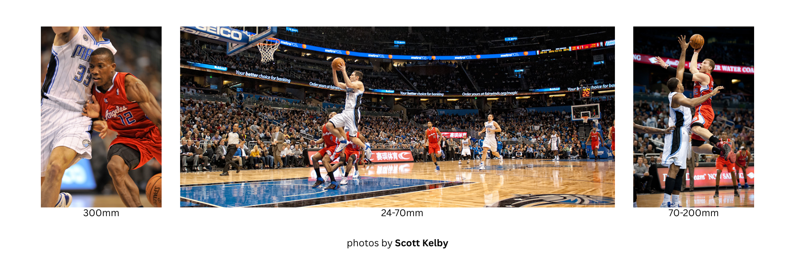

# 🏀 Three Point Focus
### Author: Christian Vaikona

This project uses NBA 3‑point tracking data to model players’ shooting hotspots and translate them into optimal baseline positions for sports photographers, showcasing an end‑to‑end Python + SQL + R analytics workflow

### Tech Stack:

- **Languages**:        `Python` `SQL` `R`
- **Python libraries**: `pandas` `numpy` `scikit-learn` `nba_api`
- **Database**:         `MySQL`
- **R libraries**:      `ggplot2` `DBI`
- **Tooling**:          `Jupyter Notebooks` `Git` `GitHub` `structured src/ module layout`

---

As a sports photographer hobbyist, I like to delve into the nitty-gritty details of the craft every now and then. One of these details is positioning. This detail leads to questions like "Where should I be? Where might be the best spot for me to get a really cool picture from?". 

Let's say I'm at an NBA game. I've been asked to photograph the best 3-point shooters in the game. Now, typically, photographers are only allowed on the baselines of the court, if near the court at all. This simplifies the job, but I want THE optimal spot on the baseline. This project aims to provide just that.

---

**Technical speaking...**

I am taking all data directly related to the players' shooting statistics, filtering shot location coordinates to those outside of the 3-point boundary, then splitting by player, modeling their statistics, tendencies, and predicitions of zones where the player will shoot their 3-point shots from and using results to provide recommendations for photographer's optimal location.

---

There are a couple other factors that I, as the photographer, am going to think about when choosing THE optimal spot. One of which is which hand they shoot with, maybe even their entire shooting form. Trivial to some, this makes or breaks a photo. The last thing I want is the player's face to be covered by their arm when shooting. Here are some examples:

Which photo do you think might make it harder for a viewer to identify the player? 

---

**Technically speaking...**

I incorporate an encoded series indicating whether a player is a left-handed shooter or right-handed. Following the modeling of zones they are likely to shoot from, recommmedations for placement of photographers will be emphasized opposite the side of the player's shooting hand from the zone (i.e. Photographer facing the player, if the player shoots right-handed, the photographer will be recommended to be to the right of the player's shooting zone).

[Plot Figure Example]

---

Another factor I want to consider when choosing my spot is my equipment, more importantly the focal length and aperature of the lenses I bring to the game. 

*While focal length determines how far a subject can be and remain in focus, aperature determines how blurry the background of the image will be. The larger the focal length, the further the subject can be and vice versa. The larger the aperature (usually a number preceded by an "f"), the more in focus the background will be and vice versa.*

For sports, the ideal aperature is f2.8 and I will assume this ideal for this project. The standard focal length in sports photography is a 70-200mm lens. This is generally optimal for about a 15-38 yard reach. However, I also want to curate some photos with a variety in perspective as the pictures show. When I can understand where the player will most likely shoot from, I can start to think about and plan some photos I think will be pretty cool and choose the best equipment and locations for those photos, stepping out of what may be THE optimal location to shoot the player at all.

The following are standard practice specs and ranges they are meant for:

| Standard Lens Specifications | Range of Reach |
|------------------------------|----------------|
| 24-70mm f2.8                 | 2-7 yds        |
| 70-200mm f2.8                | 15-38 yds      |
| 300mm f2.8                   | 30-56 yds      |
| 400mm f2.8                   | 40-75 yds      |

---

**Technically speaking...**

I will have determined an axis parallel to the baseline of the court along which the positioning of the photographer will generally be (Media zones are typically determined by league officials). Following the modeling of zones the players are likely to shoot from, I will calculate the average distance between the zone and the general optimal location for the photographer as well as calculate other options for a photographer per lens specifications. I will discretize this into groups using the yard ranges as bins.

---

With this tool in hand, a photographer, such as myself, has much more control and information to be dialed in with.

I give you **Three Point Focus**